# Bucket List

## Description

Bucket List is a social media platform where users can add and cross off travel destinations of their personal bucket lists, view other users profile pages and invite friends to add destinations to their list.

It’s a full stack web application based on a React frontend and Django backend. The data is served from a Postgres database containing multiple relationships and CRUD functionality.

## Deployment link

https://bucket-list-c3f4527a7512.herokuapp.com/

## Timeframe & Working Team (Solo)

I was given 10 days to independently build a fully functional full stack application.

## Technologies Used

### Frontend

- React
- JavaScript
- Bootstrap
- Sass

### Backend

- Django
- Python
- PostgreSQL

### Version control

- Git
- Github

### Others

- Figma
- Trello
- Heroku

## Brief

### You must:

* **Build a full stack application** by making your own backend and your own frontend
* **Use a Python Django API** using Django REST Framework to serve your data from a Postgres database
* **Consume your API with a separate frontend** built with React
* **Be a complete product** which most likely means multiple relationships and CRUD functionality for at least a couple of models
* **Implement thoughtful user stories/wireframes** that are significant enough to help you know which features are core MVP and which you can cut
* **Have a visually impressive design** to kick your portfolio up a notch
* **Be deployed online** so it's publicly accessible

## Planning

### Day 1

The planning of this project included a detailed wireframe, database modeling with all relationships and a Trello board for project and time management.

I initially put together a mood board which helped me to find the style and features my platform should contain.

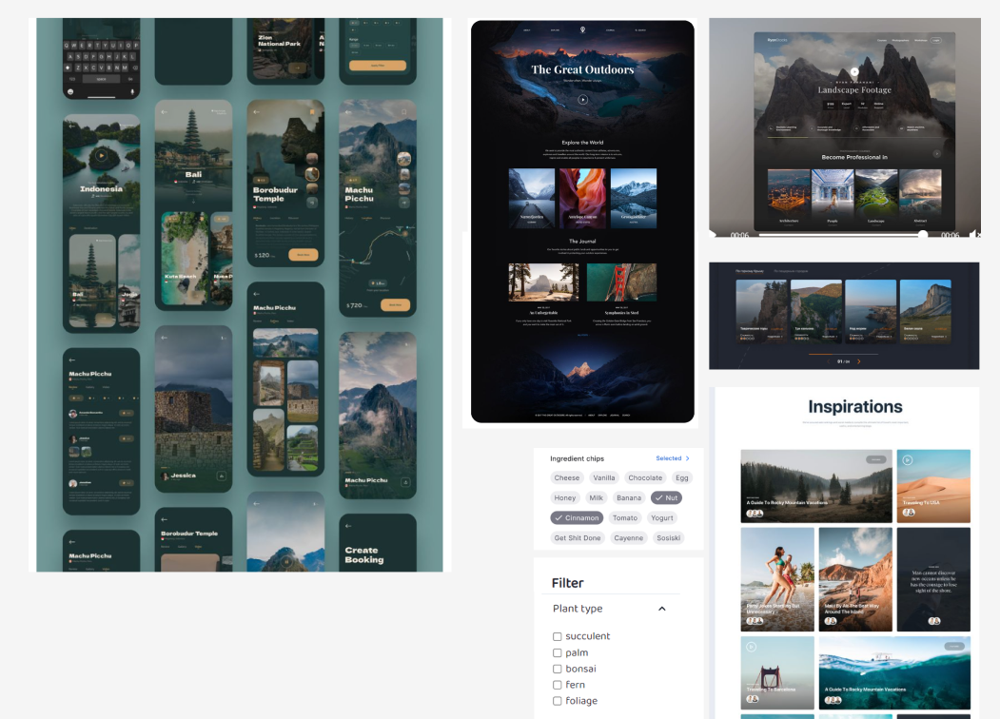

Creating a detailed wireframe was crucial for me. It helped me throughout the whole developing process to exactly know how the result has to look like and fully focus on the programming.

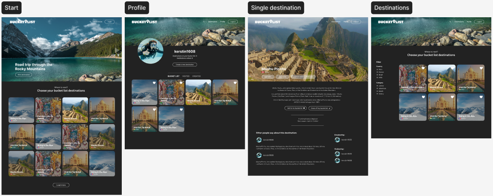

I defined four models and their individual relationships between each other.

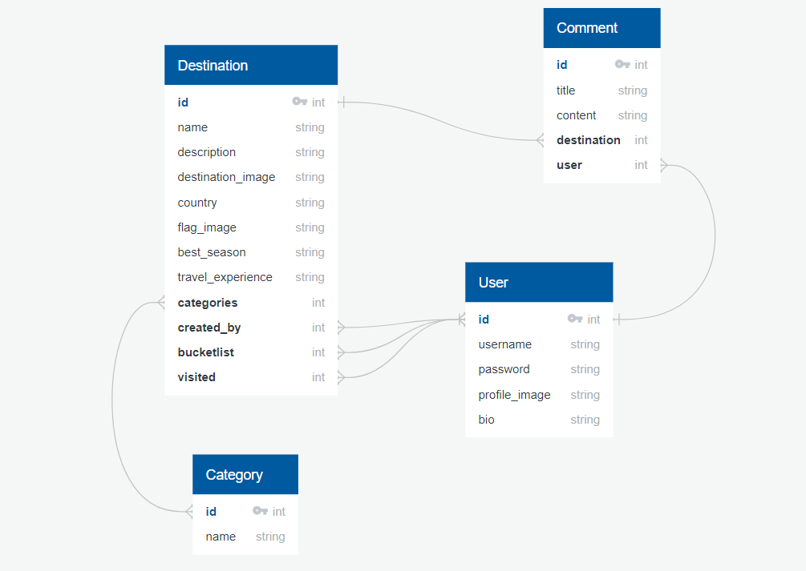

With Trello I organized use cases alongside my daily tasks and stretch goals.

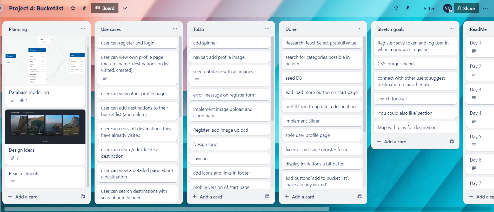

I also used this first day to research some of the features I wanted to implement and my course didn’t cover.

## Build/Code Process

### Day 2 and 3

I started building the base of my project, the backend. As I didn’t have much experience in working in the backend it was important for me to get the more difficult part done right in the beginning.

I created four models including three ManyToMany fields on the Destination Model and several ForeignKey fields throughout all models. Serializers, populations and views were implemented and the endpoints were tested in Insomnia.

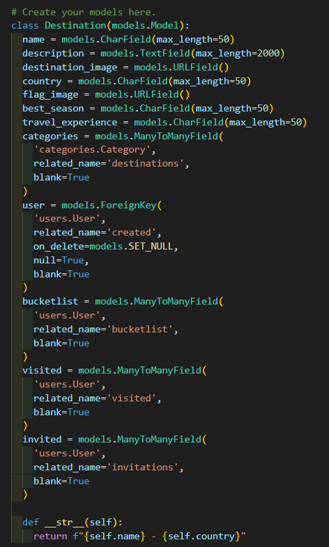

### DAY 4

I connected the front-end with the backend and kept testing my endpoints. The first thing to work on was registration and login because most features of my application depend on valid tokens. I used a Bootstrap Modal for implementing a reusable form to enable register and login.

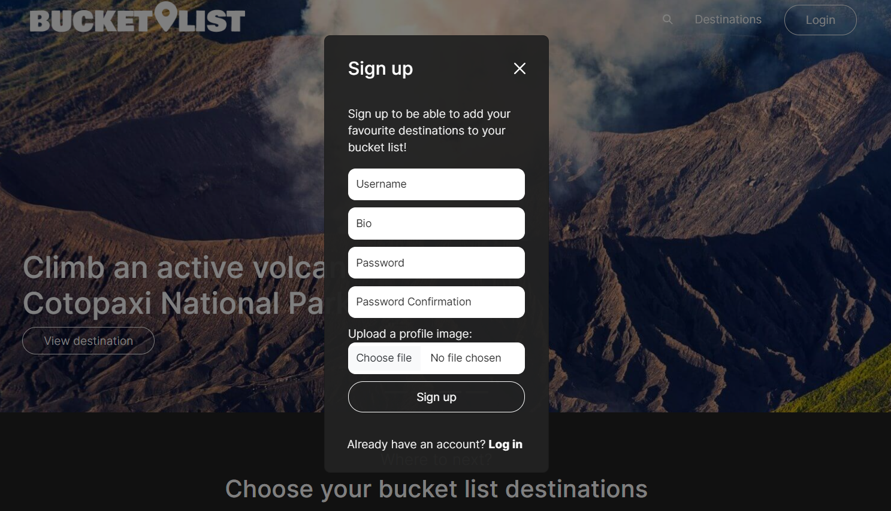

I added the SingleDestination component including two buttons which users can use to add or remove a destination from their bucket list and their already visited places. For this I created two individual endpoints which look for the bucket list section like this:

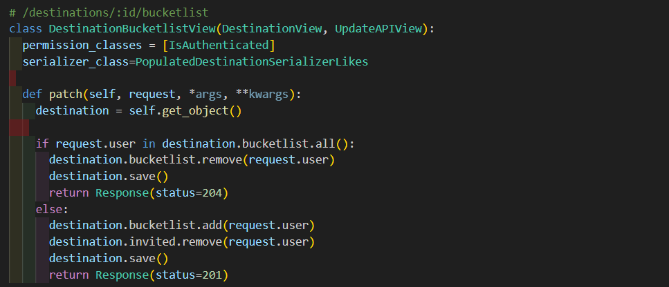

Live:

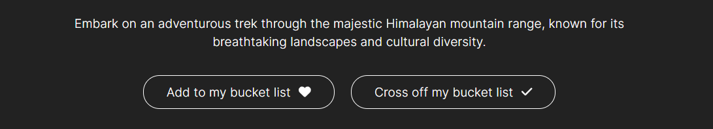

After making this API call, the page gets rerendered automatically so the user can see whether they have destinations on their lists without having to manually reload the page.

Besides this I displayed other information about the destination as well as a comment function for authenticated users.

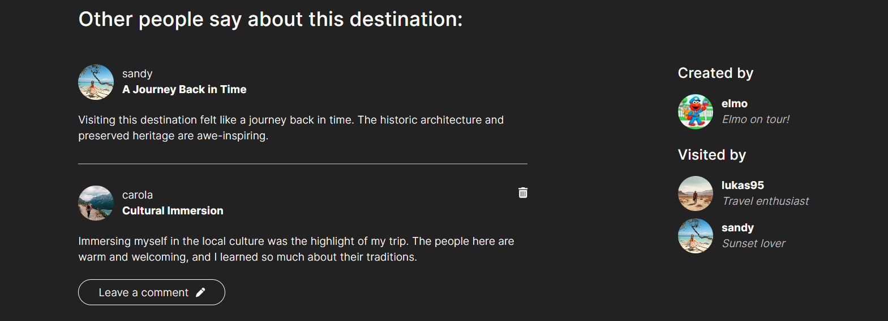

### Day 5

It was time to finally seed the Database. I used ChatGPT to add detailed destinations as well as users and randomly assigned comments.

The full-width slider was created by using a Bootstrap Carousel. Filters can be used on the Destinations page. They get dynamically created depending on all of the available countries and categories.

One of my favorite features of this application is the search bar. Thanks to the fixed navigation it is accessible from everywhere and shows relevant suggestions to the user's input (search by name, country, categories). It is a nice add-on and makes the user experience more exciting.

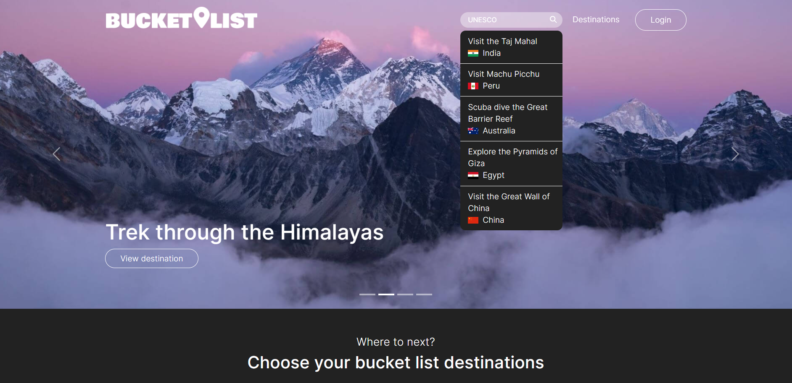

### Day 6

I used day 6 to build a reusable form which enables users to create and edit a destination. I came across the problem of required form fields when sending off a request to a populated database model. After researching I discovered in the Django REST framework documentation that it is possible to set different serializers for read and write operations.

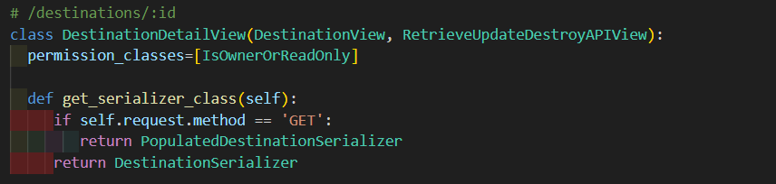

I used React Select to implement the different categories in a user friendly way. Setting a value allows the selected options to be preselected when editing an existing destination.

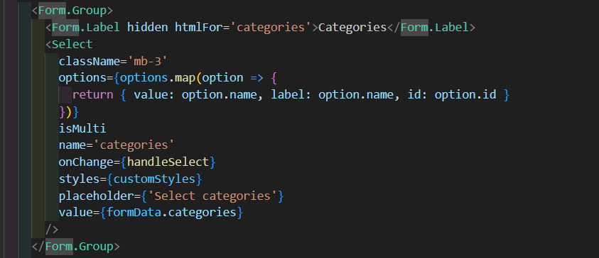

### Day 7

I dedicated day 7 to work on my styling and fix some smaller bugs I detected along the way. For example wrong displaying error messages and accessing the id of the logged in user from everywhere.

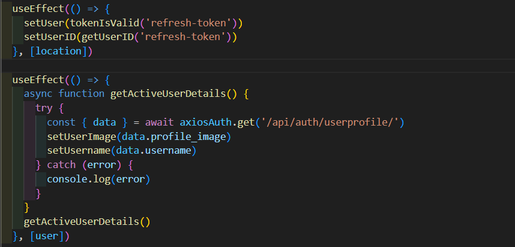

### Day 8

I completed my MVP and had time to think about my stretch goals. The most interesting one was a feature to invite other users to visit a destination. For this I added another ManyToMany field on the destination model which allows the invited user to be added to this specific destination. Then I created two endpoints which allow to add and delete a user from this field:

Backend:

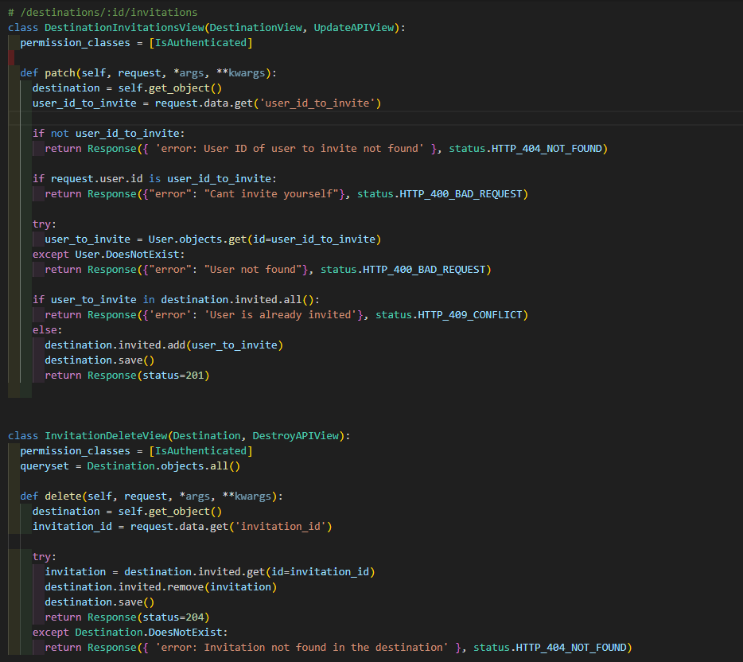

Frontend:

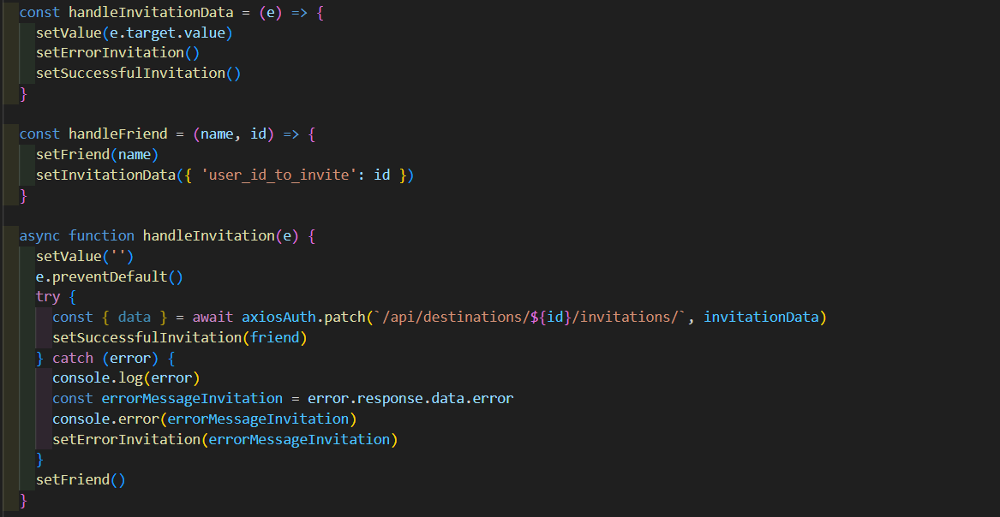

Whenever a user logs into their account, the invitations will pop up and can be accessed by clicking a button.

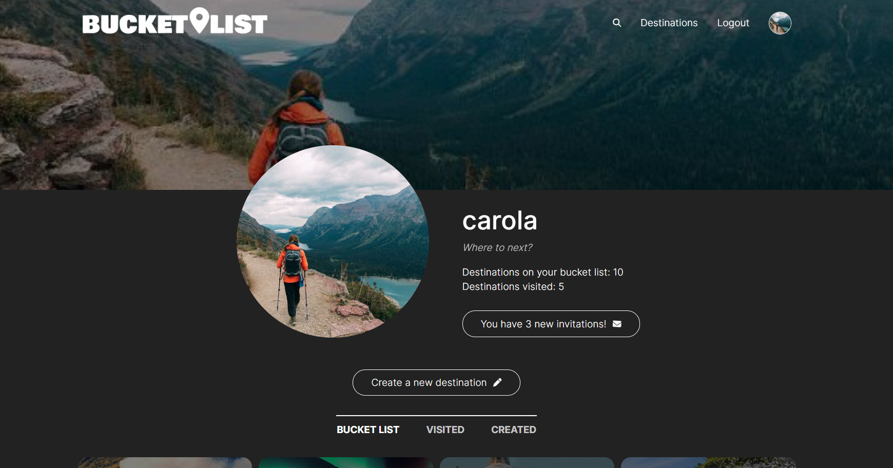

My second stretch goal was to implement a burger menu for the mobile view as my navigation didn’t display well and was difficult to use. This feature really upgraded the first impression when opening my web application.

### Day 9

On day 9 I deployed the application to Heroku. I also used the time left for adding an automatic login after a new user registers. The function to create tokens manually worked perfectly fine for this feature and the result provides a much better user experience.

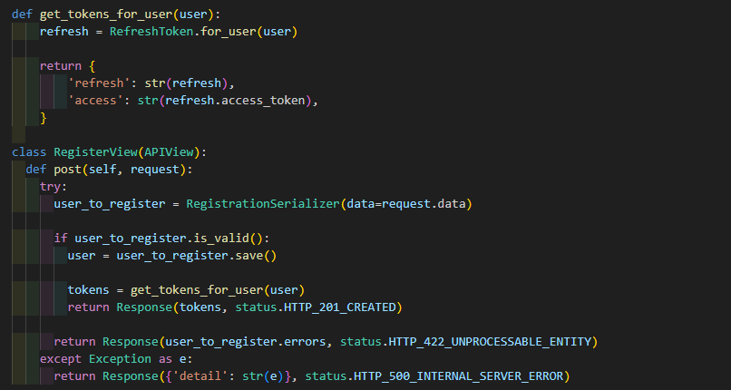

### Day 10

After deploying the application to Heroku I urgently had to improve the performance of my website. The loading time exceeded over 20 seconds which I will discuss further under the next section.

## Challenges

The biggest challenge I faced in this project arose after the deployment when the loading time of my website exceeded over 20 seconds in total. I took different attempts to solve this issue, starting with changing the database provider and compressing all images that were stored on cloudinary. Not noticing much of a difference I started to look into modifying pagination styles to reduce the retrieved data from a request. This improved the loading time of the slider but the result was still not satisfactory.

After researching I started to create more specific serializers and views for specific requests, focusing on only getting the needed data back, instead of using heavily populated serializers for every request. This made all the difference!
After talking to my instructor I additionally learned about the method 'prefetch_related' which can significantly improve the performance of an application. By using prefetch_related Django will retrieve the related objects in a more optimized way, reducing the number of database queries. 

## Wins

A key success of this project was replicating the wireframe down to the smallest detail. The precise planning gave me a clear structure and helped to focus on achieving this result.

Another personal win is that I completed this project within the scheduled time frame, meeting the necessary requirements and being able to achieve some of my stretch goals. This was possible through efficiently organizing tasks and managing time.

## Key Learnings/Takeaways

A big takeaway for me after this project is that I feel more confident in working in the backend. As I haven’t focused on this in previous projects, I kept it simple and functional in the beginning. Throughout the project I kept extending the functionalities and learned a lot about Django.

I also got a much better understanding about the whole process of implementing authentication and the usage of tokens.

I have also learned how important it is to think about the performance of a website and how valuable a well-thought-out-plan is.

## Bugs

No bugs known.

## Future Improvements

- Creating an Invitation Model to store more information about the invitation made, in order to display the user who sent the invitation, the date it got sent and a message of the inviter
- Possibility to follow other users
- Displaying recent activities of other users on start page, like destinations added or visited, comments made or invitations sent
- Individual ‘You could also like’ section with suggestions based on what destinations the user liked before
